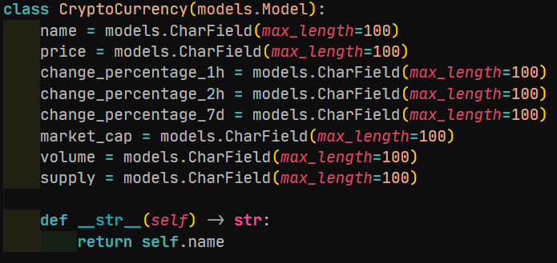
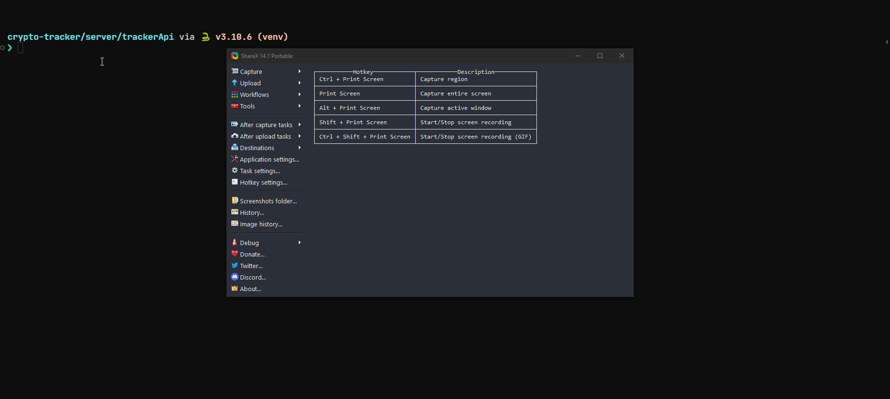
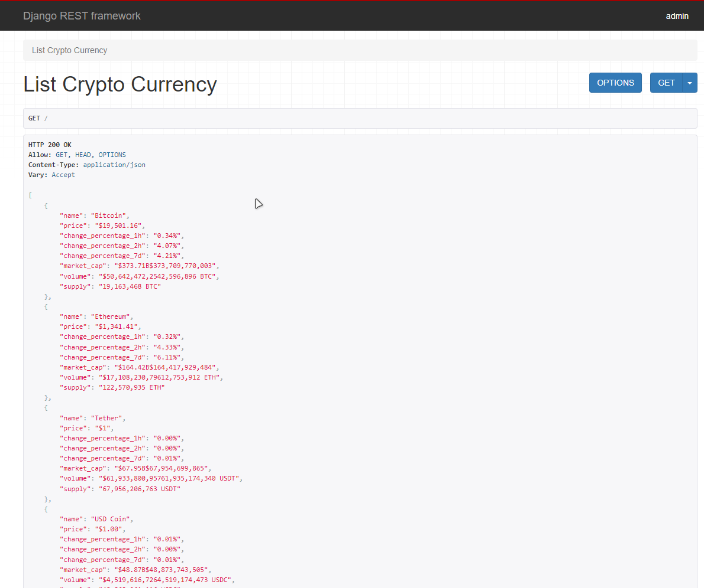
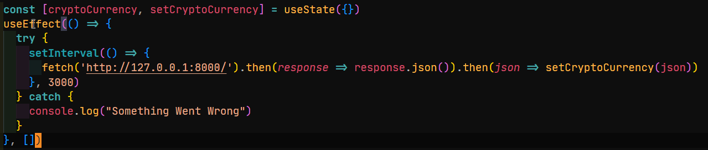
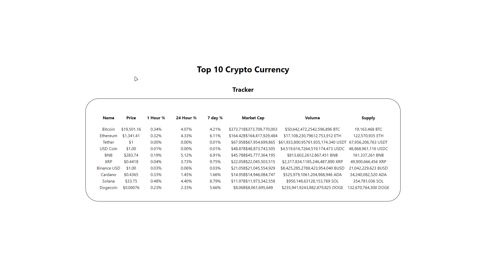

# Real Time Crypto Tracker

Clone this repository to test this implementation.

Technologies Used:

- Django (Backend)
- React.js
- BeautifulSoup4
- Requests
- RabbitMQ
- Celery

# Implementing the backend with Django

## Created a new Project

Created a new Project in the Server Directory namely trackerApi.
Also created a django App for apis

## Creating the Models:

For the App Api, created a model to store Crypto Information

## Creating Tasks for Celery

For Extracting the data and storing in the database, created a Crawl Currency Task.
This will get executed every 5 seconds, update the table if the coin already exists in the table else it will create a new entry for that specific coin.
This task is responsible for the crawling and fetching of data through requests and beautifulsoup

## Rendered the API view

# Implementing the frontend with React.js

After enabling CORS for our django app, I started working on the frontend of react.

## useEffect

Utilized the useEffect hook to fetch the APIs generated by our backend,
this useEffect had a setInterval callback which ran every 3 seconds, calling our APIs every 3 second.

This sets our cryptocurrency state, and we render the cryptocurrency state in form of a simple table.

# How to test?

## Install the Django Dependencies

### Windows

`pip install -r requirements.txt`

### Linux/Max

`pip3 install -r requirements.txt`

## Install the React Dependencies

### Windows/Linux/Mac

- Run the following in client directory

  `npm install`

## Run the server and client

### Start Celery

- Run the following in the trackerApi folder inside server

  `celery --app trackerApi worker -l info`

### Start Django Server

- Run the following in the trackerApi folder inside server

  `python3 manage.py runserver`

### Start React

- Run the following in the client folder

  `npm start`

# Thanks for reading
